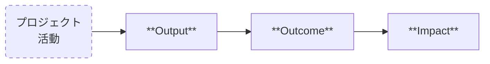
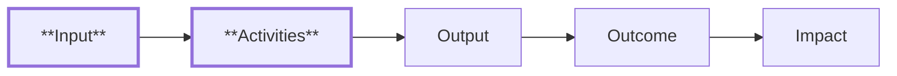

# はじめに

最近、開発をしているとこれらの言葉を耳にすることが大分増えました。

- **Output（アウトプット）**
- **Outcome（アウトカム）**
- **Impact（インパクト）**

当たり前のように使い始めていましたが、気になったので、どのようなに経緯で広まったのか調べてみました。

簡単な言葉の解説と共に紹介します。

# 解説

大まかな関係を図示しました。

## Output（アウトプット）

- プロジェクトや活動の**直接的な成果物や結果**を指す
- **具体的**で**測定可能**なものである
- プロジェクトの**完了時点で得る**ことができる

**例**

- リリースされた機能
- 公開されたマニュアル

## Outcome（アウトカム）

- Outputがもたらす**短期的な効果**を指す
- プロジェクトや活動が終了した後に**観察される変化や影響**である
- Outcomeを**複数に分けて**いるケースもある ex. 短期・中期・長期

**例**

- 機能の利用による顧客満足度の向上
- マニュアル記載による問い合わせ工数の削減

## Impact（インパクト）

- Outcomeがさらに広範囲に及ぼす**長期的な影響**を指す
- 社会全体や特定のコミュニティに対する**最終的な効果**を意味する
- **Impactがない**ケースもある（複数Outcomeのケース）

**例**

- 問い合わせ工数の削減による業務効率の向上（コスト）
- 顧客満足度の向上による契約継続率の上昇（品質）

# 経緯

どのようなに広まったのか調べた結果です。

**※個人的な調査なので、間違っている可能性があるのでご注意ください。**

## User Story Mapping（ユーザー・ストーリー・マッピング）

ソフトウェア界隈で良く使われるようになったのは、**Jeff Patton**さんの影響が強いようです。

https://vimeo.com/206617354

ご本人のサイトがあり色々と紹介されています。

https://jpattonassociates.com/story-mapping/

## Logic Model（ロジック・モデル）

上記でソフトウェア界隈と書いたのは、**政府系の政策評価**にも良く利用されているからです。
こちらは**プロジェクトの計画、実行、評価を体系的に行うための手法**のようです。

https://en.wikipedia.org/wiki/Logic_model

**構成**

このモデルだと前ステップが明示的に定義されています。

- **Input（インプット）**: プロジェクトや活動のために投入されるリソース
- **Activities（アクティビティ）**: インプットを使用して行われる具体的な活動

**利用例**

内閣府ホームページを始め、多くの行政の政策評価で利用されています。

[[PDF] 社会的インパクト評価の普及促進に係る調査 最終報告書](https://www.cao.go.jp/others/kichou/ebpm/h28_si_chousa_11.pdf)

## Results Chain（リザルツ・チェーン）

日本語だと「**結果・成果の連鎖**」と言うようですが、記事は英語でも少なく、日本語は僅かでした。

以下のような使い分けのようです。

- ロジック・モデル：チェーン部分も含めた**因果関係の理論**
- リザルツ・チェーン：チェーン部分にフォーカスした**表現ツール**

# おわりに

メモ書きのような内容ですが、参考になれば幸いです。

# おまけ

話題のDeep Researchで調べてみたのですが、良く利用される単語の組み合わせだと、私の力量では期待する結果を得られなかったので、結局は自分で調べて書くことになりました。
